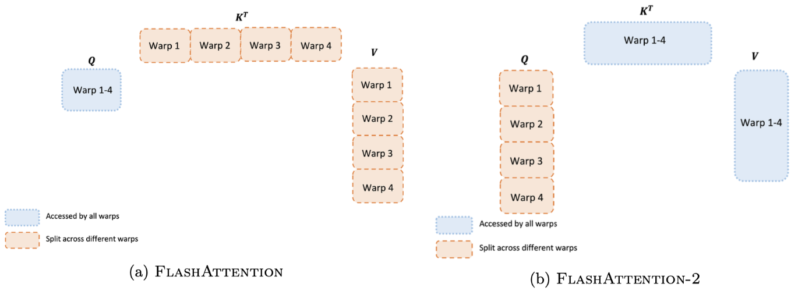

# CSCI596 Final Project Exploring FlashAttention

## Recap on Self-Attention 

$$
\textbf{S} = \textbf{QK}^T\in\mathbb{R}^{N\times N}, \textbf{P} = \text{softmax}(\textbf{S})\in \mathbb{R}^{N\times N}, \textbf{O} = \textbf{PV}\in \mathbb{R}^{N\times d}
$$

#### Algorithm

Matrices S and P are large and need to be instantiated in HBM for storage, which will bring a lot of access times to HBM and ultimately reflect the long end-to-end delay of the algorithm time.

## FlashAttention (Tiling)

Original softmax:
$$
m(x):=\max _i x_i, \quad f(x):=\left[\begin{array}{lll}
e^{x_1-m(x)} & \ldots & e^{x_B-m(x)}
\end{array}\right], \quad \ell(x):=\sum_i f(x)_i, \quad \text{softmax}(x):=\frac{f(x)}{\ell(x)}
$$

Decomposed softmax:

$$
\begin{equation}
\begin{aligned}
& m(x)=m\left(\left[x^{(1)} x^{(2)}\right]\right)=\max \left(m\left(x^{(1)}\right), m\left(x^{(2)}\right)\right), \quad f(x)=\left[\begin{array}{ll}
e^{m\left(x^{(1)}\right)-m(x)} f\left(x^{(1)}\right) & e^{m\left(x^{(2)}\right)-m(x)} f\left(x^{(2)}\right)
\end{array}\right], \\
& \ell(x)=\ell\left(\left[x^{(1)} x^{(2)}\right]\right)=e^{m\left(x^{(1)}\right)-m(x)} \ell\left(x^{(1)}\right)+e^{m\left(x^{(2)}\right)-m(x)} \ell\left(x^{(2)}\right), \quad \text{softmax}(x)=\frac{f(x)}{\ell(x)} .
\end{aligned}
\end{equation}
$$

With the forward pass of FlashAttention, with tiling and softmax rescaling, they operate by blocks and avoid having to read/write from HBM, while obtaining the correct output with no approximation.

#### Algorithm

## FlashAttention2

### Fewer non-matmul FLOPs

The algorithm from FlashAttention has been modified to decrease the number of non-matrix multiplication (non-matmul) Floating Point Operations (FLOPs). This adjustment is crucial because modern GPUs, such as Nvidia's with Tensor Cores, are optimized for matrix multiplication operations, making them significantly faster. For instance, Nvidia's A100 GPU can achieve a maximum theoretical throughput of 312 TFLOPs per second for FP16/BF16 matrix multiplication, but only 19.5 TFLOPs per second for non-matrix multiplication FP32 operations. In practical terms, each non-matmul FLOP is approximately 16 times more costly than a matmul FLOP. To ensure high throughput, the focus is on maximizing the time spent on matrix multiplication FLOPs.

Furthermore, the online softmax technique used in FlashAttention has been reworked. This revision aims to reduce the number of rescaling operations, along with boundary-checking and causal masking operations, all while maintaining the same output. This change further enhances the efficiency of the algorithm, aligning with the goal of reducing the reliance on more costly non-matmul FLOPs.

### Better Parallelism

In its initial version, FlashAttention achieves parallelization by dividing tasks based on the batch size and the number of attention heads. Each attention head is processed by one thread block, leading to a total of (batch_size * number of heads) thread blocks. These thread blocks are then allocated to run on streaming multiprocessors (SMs), with an example being the Nvidia A100 GPU which has 108 SMs. This method of scheduling proves efficient, especially when the number of thread blocks is large (e.g., 80 or more), allowing for nearly full utilization of the GPU's computational resources.

However, for scenarios involving long sequences, which typically correspond to small batch sizes or a reduced number of heads, an additional layer of parallelization is introduced to better leverage the GPU multiprocessors. This is achieved by also parallelizing over the sequence length dimension. This enhancement leads to a significant speedup in such cases, optimizing the processing efficiency for long sequences where the initial parallelization approach may have been less effective.

### Better Work Partitioning

Within each thread block, there is still a decision to be made about partitioning the work between different warps (a group of 32 threads working together). Typically, 4 or 8 warps per thread block are utilized, and the partitioning scheme is outlined below. The partitioning in FlashAttention-2 has been enhanced to minimize synchronization and communication between different warps, leading to fewer shared memory reads/writes.

In FlashAttention, each block divides K and V across four warps, maintaining Q access for all warps, a method known as the “sliced-K” scheme. This approach, however, is inefficient as all warps must write their intermediate results to shared memory, synchronize, and then combine these results. The extensive shared memory reads/writes in this process hinder the forward pass in FlashAttention.

Conversely, FlashAttention-2 adopts a different strategy where Q is split among four warps, while K and V remain accessible to all warps. Following this, each warp performs a matrix multiplication to obtain a segment of QK^T, and then simply multiplies it with the shared segment of V to obtain their respective output segment. This eliminates the need for inter-warp communication. The reduction in shared memory reads/writes brought about by this new method results in a notable speedup.

## Exploring FlashAttention with LongFormer

Longformer used global attention and local attention for longer sequences input, with FlashAttention reducing the computational cost, LongFormer may be able to capture longer input.

### Adapting FlashAttention to Different GPU Architecture

FlashAttention is sensitive to GPU architecture. Currently FlashAttention supports Ampere, Ada, or Hopper GPUs, such as A100 or H100 or RTX 4090, Turing GPUs or lower are not commonly supported. We will try to adapt FlashAttention to such GPU architecture for more generalized use.
