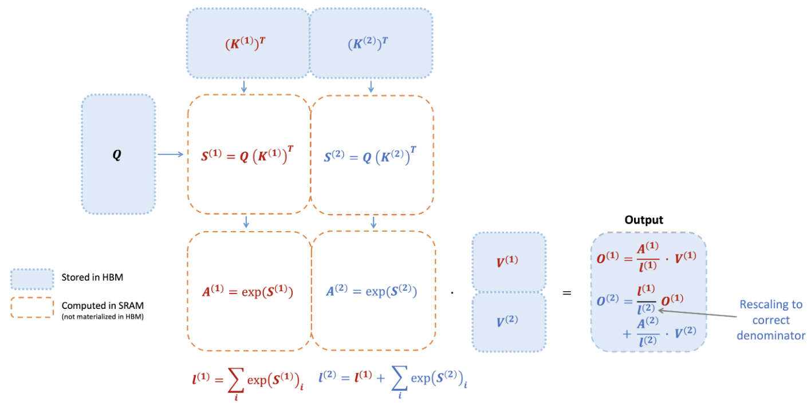

# CSCI596 Final Project Proposal: Exploring FlashAttention and In-context Learning

## Recap on Self-Attention 

$$
\textbf{S} = \textbf{QK}^T\in\mathbb{R}^{N\times N}, \textbf{P} = \text{softmax}(\textbf{S})\in \mathbb{R}^{N\times N}, \textbf{O} = \textbf{PV}\in \mathbb{R}^{N\times d}
$$

#### Algorithm

Matrices S and P are large and need to be instantiated in HBM for storage, which will bring a lot of access times to HBM and ultimately reflect the long end-to-end delay of the algorithm time.

## FlashAttention (Tiling)

Original softmax:

$$
m(x):=\max _i x_i, \quad f(x):=\left[\begin{array}{lll}
e^{x_1-m(x)} & \ldots & e^{x_B-m(x)}
\end{array}\right], \quad \ell(x):=\sum_i f(x)_i, \quad \text{softmax}(x):=\frac{f(x)}{\ell(x)}
$$

Decomposed softmax:

$$
\begin{equation}
\begin{aligned}
& m(x)=m\left(\left[x^{(1)} x^{(2)}\right]\right)=\max \left(m\left(x^{(1)}\right), m\left(x^{(2)}\right)\right), \quad f(x)=\left[\begin{array}{ll}
e^{m\left(x^{(1)}\right)-m(x)} f\left(x^{(1)}\right) & e^{m\left(x^{(2)}\right)-m(x)} f\left(x^{(2)}\right)
\end{array}\right], \\
& \ell(x)=\ell\left(\left[x^{(1)} x^{(2)}\right]\right)=e^{m\left(x^{(1)}\right)-m(x)} \ell\left(x^{(1)}\right)+e^{m\left(x^{(2)}\right)-m(x)} \ell\left(x^{(2)}\right), \quad \text{softmax}(x)=\frac{f(x)}{\ell(x)} .
\end{aligned}
\end{equation}
$$

With the forward pass of FlashAttention, with tiling and softmax rescaling, they operate by blocks and avoid having to read/write from HBM, while obtaining the correct output with no approximation.

#### Algorithm

## Llama

**LLaMA** is a transformer-based, open-sourced large language model. It has four versions, including 7B, 13B, 33B, and 65B. LLaMA-13B outperforms GPT-3 (175B) on most benchmarks, and LLaMA-65B is competitive with the state-of-the-art models Chinchilla-70B and PaLM-540B. With Pre-normalization, SwiGLU activation function, and Rotary Embeddings, LLaMA is trained on various datasets and performs as state-of-the-art in different tasks. More importantly, LLama supports float point 16 precision that reduces the weight and computational cost without losing performance. It is one of the best choices to deploy LLMs locally.

## In-context Learning

In-context learning has emerged as a novel attribute of large language models, enabling them to execute a variety of tasks based on a set of input-output examples, without the need for any parameter updates or fine-tuning. This feature has been demonstrated in major language models such as ChatGPT and LLaMA, garnering widespread attention in the research community. One area of study focuses on understanding the fundamental mechanisms and principles underlying contextual learning. For example, Xie et al. view contextual learning as implicit Bayesian inference, while Dai et al. interpret it as meta-optimization. Another area of research explores different strategies for selecting and designing contextual examples for large language models. Wang et al. proposed a novel training approach to model the interactions between contextual examples, determinantal processes and sequential decision-making are introduced as a preliminary exploration. In contrast, structured prompts break the limitation of input context length and expand the number of contextual examples to several thousands. Retrieval Augmented large language models combine the generative capabilities of large language models with the ability to retrieve relevant information from external sources. This paradigm has the potential to enhance the factual consistency of generated texts, enable large language models to understand up-to-date knowledge and provide a natural way for source attribution. For contextual learning, the goal of retrieval augmentation is to improve the performance of large language models on downstream tasks by enriching them with information-rich examples retrieved.

## Proposal

Equipping Llama with FlashAttention for long document in-context learning.  See detailes in [proposal](CSCI596_Final_Proposal.pdf).

